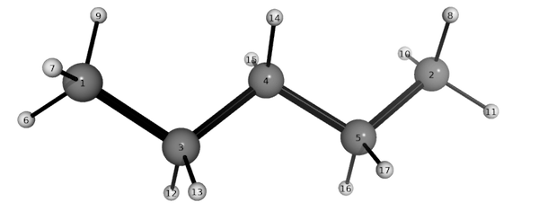
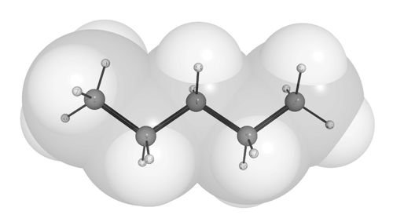
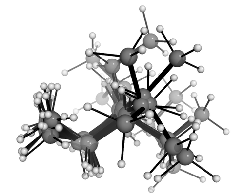

# wSterimol

wSterimol is an automated computational workflow which computes multidimensional [Sterimol](http://doi.org/10.1021/bk-1984-0255.ch016) parameters. For flexible molecules or substituents, the program will generate & optimize a conformational ensemble, and produce Boltzmann-weighted Sterimol parameters. It has been developed as a [PyMol](https://pymol.org/2) plugin.

```
                   ____ ______ ____ ___   ____ __  ___ ____   __           
          _    __ / __//_  __// __// _ \ /  _//  |/  // __ \ / /           
         | |/|/ /_\ \   / /  / _/ / , _/_/ / / /|_/ // /_/ // /__          
         |__,__//___/  /_/  /___//_/|_|/___//_/  /_/ \____//____/          
                    W E I G H T E D   S T E R I M O L                      
```
[](https://zenodo.org/badge/latestdoi/143098770)

All code is written in Python and was developed by [Alexandre Brethomé](http://www.oxfordsynthesiscdt.ox.ac.uk/people/students/2015cohort.html) at the University of Oxford and [Robert Paton](http://wwww.patonlab.com) at Colorado State University. The underlying python implementation of Sterimol parameters was written by Kelvin Jackson and Robert Paton and is available as a [command-line tool](https://github.com/bobbypaton/Sterimol)

*Conformational Effects on Physical-Organic Descriptors – the Case of Sterimol Steric Parameters* Brethomé, A. V.; Fletcher, S. P.; Paton, R. S. *ACS Catalysis* **2019**, *9*, 2313-2323 [**DOI:** 10.1021/acscatal.8b04043](http://dx.doi.org/10.1021/acscatal.8b04043)

## Getting Started

These installation instructions have been successfully tested for Windows and OSX operating systems.

### Prerequisites

* [Pymol](https://pymol.org/2/) is an interactive GUI available for all platforms. Different licenses are available, from commercial to open-source. Open-source pymol is free and contains all the necessary features for [wSterimol](https://github.com/bobbypaton/wSterimol).
* The code uses the [Pymol API](https://pymol.org/dokuwiki/?id=api). Installation guides are available for [Windows](https://pymolwiki.org/index.php/Windows_Install), [OSX](https://pymolwiki.org/index.php/MAC_Install) and [Linux](https://pymolwiki.org/index.php/Linux_Install). If this is installed correctly, you should be able to type `import pymol` in the Pymol window without receiving an import error.
* [Numpy](http://www.numpy.org/) is the fundamental package for scientific computing with Python.
* A computational chemistry package: wSterimol automates the generation of a Boltzmann-weighted conformational ensemble: it talks to external compchem programs which optimize geometries and compute the energies. The current release has been tested with locally installed (i.e. on the same machine) versions of [MOPAC](http://openmopac.net/) and [Gaussian](http://gaussian.com/). A future release will expand support for [ORCA](https://orcaforum.cec.mpg.de/).

### Downloading and Installing the Code

wSterimol contains several python scripts which function as PyMol plugins. The best way to install these on your machine is to download or clone this repository (using the green button above) or from [this link](https://github.com/bobbypaton/wSterimol/archive/master.zip). Unzip the folder and move to a safe location.

There are eleven python scripts (contained in the [wsterimol](https://github.com/bobbypaton/wSterimol/tree/master/wsterimol) directory) which must be loaded into PyMol. Luckily PyMol allows you to set this up automatically so you don't need to do this every time:

* **Recommended method**: with PyMol open, open the 'File' tab and select 'Edit pymolrc'. Into this file (.pymolrc) you can paste the following text. Make sure to replace "YourPathToTheScript" with the actual location of the 'wsterimol' folder on your computer: which will be something like /Users/username/Documents/wSterimol/wsterimol

```
run YourPathToTheScript/visualize.py
run YourPathToTheScript/setup.py
run YourPathToTheScript/generate.py
run YourPathToTheScript/filter_gen.py
run YourPathToTheScript/prepare_file.py
run YourPathToTheScript/optimisation.py
run YourPathToTheScript/filter_opt.py
run YourPathToTheScript/sterimoltools.py
run YourPathToTheScript/sterimol.py
run YourPathToTheScript/weight.py
run YourPathToTheScript/wSterimol.py
```

* **Alternative method**: with PyMol open, open the Plugin Manager and then open the "Install New Plugin" tab. Now, to install from local file, use the "Choose file..." button to locate each of the eleven python scripts in the wsterimol folder and click to install them in the Plugins directory. Next time you open PyMol the names of the scripts will be shown in the "Installed PLugins" tab of the Plugin Manager. This install method works fine, although if any of the scripts are updated, then the Plugin needs to be uninstalled and the new version installed. The recommended installation method allows you to replace or copy over the python scripts and, as long as the names are unchanged, the new version will be imported next time you open PyMol.


### Example Usage - Sterimol parameters for the n-butyl group

[Sterimol](http://doi.org/10.1021/bk-1984-0255.ch016) parameters describe the steric dimensions of a given molecule or substituent. They are multi-dimensional and in most current applications, are used to measure a length (L) and a minimum and maximum width (B1 and B5) perpendicular to the L-axis. The modern application of Sterimol parameters in structure-reactivity and structure-selectivity relationships was pioneered by the [Sigman laboratory](https://chem.utah.edu/directory/sigman/research-group/index.php), who have described the [underlying theory](https://www.nature.com/articles/nchem.1297) and several [successful examples](http://doi.org/10.1021/acs.accounts.6b00194).

The length and width of the n-butyl group, and hence its Sterimol parameters, are properties which depend on its conformation. In this example, we illustrate how to automate the process of conformational sampling, filtering redundant structures, computing Sterimol parameters and subsequent Boltzmann-weighting as a single command from within Pymol.

Two files are required:
* a PDB structure file
* a “setup.ini” file which set various options for wSterimol

All input and output file are in the [example_mopac](https://github.com/bobbypaton/wSterimol/tree/master/example_mopac) directory.

Open Pymol. If the wSterimol plugins have been successfully imported (by adding [run commands to the .pymolrc](#Downloading and Installing the Code)) the workspace should have a white backgound and the PyMol console will include the run statements.

In the PyMol console, navigate to the "example_mopac" folder on your computer. For example if you have put the wSterimol folder in your /Documents folder, you would type:

```
cd /Documents/wSterimol/example_mopac/
```

This is now the working directory for PyMol. wSterimol takes its instructions from the file 'setup.ini' which must be in the current working directory. In this example, the file already exists, containing the following options:

```
SOFTWARE = MOPAC
PROG_EXEC = /opt/mopac/MOPAC2016.exe
#PROG_EXEC = C:\PROGRA~1\MOPAC\MOPAC2016.exe
SEMI_EMPIRICAL = PM6-D3H4
OPTIMISATION = YES
CHARGE = 0
SPIN = 1
RMSD_CLUSTER_OPT = 0.5
ANGLE_COUNT = 5
ATOMIC_MODEL = cpk
RJCT = 0.5
TEMPERATURE = 298
ENERGYWINDOW_CUTOFF = 1.0 3.0 5.0
PRINT_CUTOFF = 5.0
```

Most of these options are self-explanatory. We are using Mopac as the external program using the PM6-D3H4 level of theory to optimize geometries, for a molecule which has no charge and is closed-shell. The RMSD value is used to decide whether two conformers are distinct and the angle count is how the dihedral angles are searched. The Sterimol parameters will be computed using CPK atomic radii, and will be Boltzmann-average using the PM6-D3H4 energies at 298K. The full path of the program needs to match where this is installed on your machine: the locations shown are the defaults for OSX and Windows. These scripts can be commented using # symbols at the start of the line.

Now it should be possible to load the structure file (again typing in the PyMol console)

```
load pentane.pdb
```

Since we wish to obtain Sterimol parameters for the n-butyl substituent, it is necessary to have it attached to something: by using n-pentane, we have the n-butyl group attached to a methyl carbon atom. The length is measured from this carbon.

It is useful to see the atom-numbering, to define which bonds are rotatable. Type:

```
BallnStick pentane
```

The PyMol window should show a structure like this:



This structure has not been optmized. It is now necessary to generate different conformers, optimize their structures, and keep the unique conformations. To start wSterimol, we need to specify:
* The "primary bond" which defines the attachment of the substituent (specified by the two bonded-atoms). In this case, this is given by the indices of atoms 1 and 3 (alternatively, we could count from the other end and use 2 and 5).
* The rotatable torsions (specified by four atoms) we wish to explore. In this case, we define two carbon-backbone dihedral angles involving atoms 1,3,4,5 and 3,4,5,2.

The following command in Pymol will perform the entire series of calculations and analysis:

```
wSterimol [[id 1, id 3, id 4, id 5],[id 3, id 4, id 5, id 2]], 1, 3
```

The different scripts will be called one after another. If there is an error, it will show up immediately. Note that the atom selections in dihedrals must be bonded for the script to work. Use the 'bond' keyword if that is not the case. When the calculation is finished, “wSterimol finished” message should appear. In your working folder, two new files and one folder should have appeared as well. “temp” folder contains all the conformers in PDB format. “weighted.txt” contains the wSterimol values. The (abbreviated) output in "weighted.txt" shows the following:

```
Structures                   E (kcal/mol)  L1 (A)  B1 (A)  B5 (A)    (%)
pentane_21.out                       1.89    5.27    1.89    4.51   1.48
...
pentane_13.out                       0.00    7.38    1.70    2.78  35.28
pentane_15.out                       0.58    6.40    1.89    4.04  13.31
pentane_16.out                       0.57    6.44    1.91    3.95  13.60

*******************************************************************************
**                        wL (A)   wB1 (A)   wB5 (A)                         **
**                          6.70      1.77      3.54                         **
*******************************************************************************
```

The Sterimol parameters are listed for each conformer along with the relative energy and Boltzmann population. The final Boltzmann-weighted values are shown below. In this case, we can see that the most stable conformation (pentane_13, which is anti-anti as expected) has L, B1 & B5 values of 7.38, 1.70 & 2.78, respectively. The averaged values are shorter (smaller L) and fatter (larger B5), which makes sense since gauche conformations are included in the ensemble.

One can also start playing a little bit with the structures by visualizing for instance the Van der Waals surfaces by writing depending on what atomic model you desire:

```
Add_VDW pentane, bondi
```
One can also visualize all the conformers at the different stages of the calculation by simply using:
```
AddConformers temp
```
Note: "temp” being the default name for the folder containing all the conformers.

 


### Comparing the results against DFT
We can repeat the above example using density functional theory instead of semi-empirical calculations. All input and output file are in the [example_gaussian](https://github.com/bobbypaton/wSterimol/tree/master/example_gaussian) directory. The 'setup.ini' file now specifies that the calculations will use Gaussian, along with the path to a script which will run Gaussian jobs. Presently, wSterimol expects \*out output files (i.e. rather than \*log). We will request M06-2X-D3/6-31G(d) optimizations running on 4 processors per job, which are executed sequentially.

```
SOFTWARE = GAUSSIAN
PROG_EXEC = ./g16sub
LEVELOFTHEORY = opt=(maxcycles=160) M062X/6-31G(d) emp=GD3
PROCSSHARED = 4
```

We have found it easier to create a shell script ('g16sub') rather than running the Gaussian jobs from within the PyMol plugins. This script sets the environment variables and ensures that the output files have the correct ending.
```
Sexport g16root=/Applications
export GAUSS_SCRDIR=$TMPDIR
source $g16root/g16/bsd/g16.profile
g16 <$1.com >$1.out
```

Following the same protocol as before, but making sure that the PyMol working directory is now the example_gaussian:

```
cd /Documents/wSterimol/example_gaussian/
load pentane.pdb
wSterimol [[id 1, id 3, id 4, id 5],[id 3, id 4, id 5, id 2]], 1, 3
```

Results in the following output in 'weighted.txt'

```
Structures                   E (kcal/mol)  L1 (A)  B1 (A)  B5 (A)    (%)
pentane_19.out                       0.48    6.29    1.90    4.10  12.22
pentane_18.out                       0.00    7.39    1.67    2.74  27.27
...
pentane_9.out                        2.44    5.49    1.90    4.51   0.45
pentane_10.out                       0.48    6.29    1.90    4.10  12.22

*******************************************************************************
**                        wL (A)   wB1 (A)   wB5 (A)                         **
**                          6.33      1.79      3.75                         **
*******************************************************************************
```

The Sterimol parameters for the most stable conformer (pentane_18, trans-trans) are: L1 = 7.39, B1 = 1.67, B5 = 2.74. These all differ by < 0.05Å when compared with the earlier semi-empirical values, since both sets of calculations predict the same conformation to be most stable. The weighted values do show more variation though, as one might expect, since these depend on the relative conformer energies which are generally more method-dependent than the structures themselves. So we see that the DFT results produce a shorter weighted L1 by 0.4Å and a wider B5 by 0.2Å, as this level of theory predicts that the population of the long-and-narrow trans,trans-conformer is smaller (27 vs 35%).

## Acknowledgements

We acknowledge the [EPSRC Centre for Doctoral Training in Synthesis for Biology and Medicine](http://www.oxfordsynthesiscdt.ox.ac.uk/) (EP/L015838/1) for a studentship to A. V. B., generously supported by AstraZeneca, Diamond Light Source, De- fense Science and Technology Laboratory, Evotec, GlaxoSmithKline, Janssen, Novartis, Pfizer, Syngenta, Takeda, UCB and Vertex.

## Citation

This code is released under the MIT license. Commercial use, Modification, Distribution and Private use are all permitted. The use of wSterimol can be acknowledged with the following citation:
*Conformational Effects on Physical-Organic Descriptors – the Case of Sterimol Steric Parameters* Brethomé, A. V.; Fletcher, S. P.; Paton, R. S. *ACS Catalysis* **2019**, *9*, 2313-2323 [**DOI:** 10.1021/acscatal.8b04043](http://dx.doi.org/10.1021/acscatal.8b04043)

The python implementation of Sterimol parameters was first reported in:
*Correlating Reactivity and Selectivity to Cyclopentadienyl Ligand Properties in Rh(III)-Catalyzed C-H Activation Reactions: an Experimental and Computational Study* Piou, T.; Romanov-Michailidis, F.; Romanova-Michaelides, T.; Jackson, K. E.; Semakul, N.; Taggart, T. D.; Newell, B S.; Rithner, C. D.; Paton, R. S.; Rovis, T. *J. Am. Chem. Soc.* **2017** *139*, 1296–1310 [DOI: 10.1021/jacs.6b11670](http://dx.doi.org/10.1021/jacs.6b11670)
